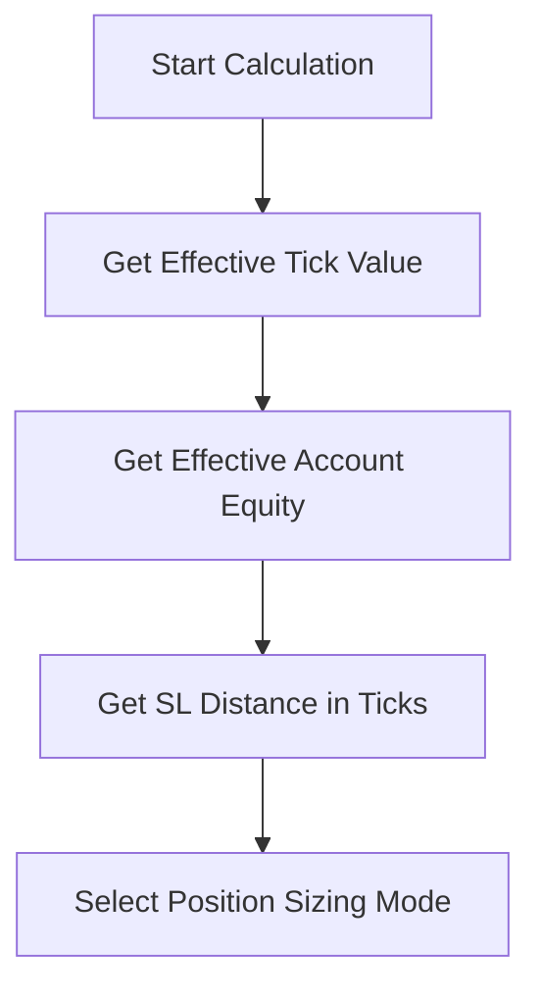

# 03. Risk Management Calculation Engine (PASO 3)

## Table of Contents
- [Overview](#overview)
- [Input Flow](#input-flow)
- [Position Sizing Modes](#position-sizing-modes)
- [Currency Assumptions](#currency-assumptions)
- [Underfunded Protection](#underfunded-protection)
- [Lot Step Quantization](#lot-step-quantization)
- [Decision Matrix](#decision-matrix)
- [Expected Log Patterns](#expected-log-patterns)

## Overview

The PASO 3 Calculation Engine is a pure calculation system that determines position quantities based on risk parameters without affecting actual trading. It serves as the foundation for PASO 4 (Integration) where calculated quantities will replace manual quantities.

### Design Principles
- **Pure Functions** - No side effects, only calculations
- **Currency Aware** - Explicit handling of quote vs account currencies
- **Underfunded Safe** - Prevents excessive risk exposure
- **Instrument Agnostic** - Works across different asset classes
- **Auditable** - Complete log trail for all decisions

## Input Flow

### 1. Auto-Detection Phase


#### Auto-Detection Sources (Priority Order)

**Tick Value Detection:**
1. `Security.TickCost` (ATAS standard)
2. CSV overrides (`MNQ=0.5;NQ=5;...`)
3. Fallback value (0.5)

**Account Equity Detection:**
1. Manual override (if set)
2. `Portfolio.BalanceAvailable` (nullable safe)
3. `Portfolio.Balance` (fallback)
4. Default value (10000)

**SL Distance Calculation:**
1. Base: `StopOffsetTicks`
2. Signal SL: +5 ticks if `UseSignalCandleSL=true`
3. Limits: Min 1 tick, Max 500 ticks

### 2. Mode Selection
The calculation engine supports three position sizing modes:

## Position Sizing Modes

### Manual Mode
- **Purpose**: Use configured quantity, calculate risk diagnostics
- **Input**: `Quantity` property
- **Output**: Same quantity, risk per contract calculated
- **Use Case**: Traditional fixed-quantity trading

```
Risk Per Contract = SL Distance (ticks) × Tick Value
Total Risk = Quantity × Risk Per Contract
```

### FixedRiskUSD Mode
- **Purpose**: Risk fixed dollar amount per trade
- **Input**: `RiskPerTradeUsd`
- **Output**: Calculated quantity to achieve target risk
- **Use Case**: Consistent dollar risk across all trades

```
Risk Per Contract = SL Distance (ticks) × Tick Value
Quantity = floor(Target Risk ÷ Risk Per Contract)
```

### PercentOfAccount Mode
- **Purpose**: Risk percentage of account equity
- **Input**: `RiskPercentOfAccount`, Account Equity
- **Output**: Calculated quantity based on account percentage
- **Use Case**: Dynamic sizing based on account growth

```
Target Risk = Account Equity × (Risk Percent ÷ 100)
Risk Per Contract = SL Distance (ticks) × Tick Value
Quantity = floor(Target Risk ÷ Risk Per Contract)
```

## Currency Assumptions

### Critical Design Decision
**PASO 3 assumes no currency conversion** between quote currency (tick values) and account currency (equity). This simplification allows for:
- Faster calculations
- Clearer audit trails
- Reduced complexity in initial implementation

### Currency Flow
```
Tick Value (Quote Currency) → Risk Per Contract (Quote Currency)
Account Equity (Account Currency) → Target Risk (Account Currency)
```

**Assumption**: Quote Currency = Account Currency (typically USD)

### Future Enhancement (PASO 3.1)
- Add currency conversion rates
- Support for multi-currency accounts
- Automatic currency detection and conversion

## Underfunded Protection

### Trigger Condition
Underfunded occurs when:
```
Risk Per Contract > Target Risk
```

This means even 1 contract would exceed the desired risk amount.

### Protection Modes

#### Skip If Underfunded (Default: true)
```
IF underfunded:
  RETURN quantity = 0
  LOG "ABORT_UNDERFUNDED"
  // Entry will be skipped
```

#### Force Minimum Quantity (Skip = false)
```
IF underfunded:
  RETURN quantity = MinQtyIfUnderfunded (default: 1)
  LOG "WARNING_UNDERFUNDED"
  // Entry proceeds with known excess risk
```

### Log Patterns
```
// Abort scenario
468/CALC UNDERFUNDED uid=abc123 action=ABORT qty=0 rpc=25.00USD target=10.00USD

// Force scenario
468/CALC UNDERFUNDED uid=def456 action=MIN_QTY qty=1 actualRisk=25.00USD target=10.00USD
```

## Lot Step Quantization

### Purpose
Ensure calculated quantities conform to instrument trading rules:
- **Lot Size**: Minimum increment (e.g., 0.1 for some instruments)
- **Lot Min Size**: Minimum quantity allowed
- **Lot Max Size**: Maximum quantity allowed

### Process
```
1. Raw Calculation → qtyRaw (e.g., 28.57)
2. Lot Step Snap → qtySnap (e.g., 28.0)
3. Min/Max Clamp → qtyClamp (e.g., 28)
4. Final Result → qtyFinal (28)
```

### Current Implementation (PASO 3)
Uses safe defaults for most instruments:
- Lot Size: 1 (whole contracts)
- Lot Min Size: 1 (minimum 1 contract)
- Lot Max Size: 1000 (safety limit)

### Future Enhancement (PASO 3.1)
- Auto-detection via `Security.LotSize/LotMinSize/LotMaxSize`
- Instrument-specific constraints
- Fractional contract support

## Decision Matrix

| Input Scenario | Mode | SL Distance | Risk/Contract | Target Risk | Result | Log Pattern |
|----------------|------|-------------|---------------|-------------|---------|-------------|
| Normal | Fixed | 10 ticks | $5.00 | $100 | 20 contracts | `CALC FIXED qty=20` |
| High SL | Fixed | 50 ticks | $25.00 | $100 | 4 contracts | `CALC FIXED qty=4` |
| Underfunded | Fixed | 100 ticks | $50.00 | $25 | 0 (abort) | `CALC UNDERFUNDED action=ABORT` |
| Force Entry | Fixed | 100 ticks | $50.00 | $25 | 1 contract | `CALC UNDERFUNDED action=MIN_QTY` |
| Percent | PCT | 10 ticks | $5.00 | $250 (1% of $25k) | 50 contracts | `CALC PCT qty=50` |
| Manual | Manual | Any | Any | N/A | User quantity | `CALC MANUAL qty=2` |

## Expected Log Patterns

### Complete Calculation Flow
```
[13:45:01.125] WARNING 468/CALC IN uid=abc123 mode=FixedRiskUSD slTicks=7 tickCost=0.50USD/t equity=25000USD note="equity in USD, tickCost in USD; no currency conversion at step3"

[13:45:01.126] WARNING 468/CALC FIXED uid=abc123 targetRisk=100USD rpc=3.50USD underfunded=false qtyRaw=28.57 qtySnap=28 qtyClamp=28 qtyFinal=28

[13:45:01.127] WARNING 468/CALC OUT uid=abc123 mode=FixedRiskUSD qtyFinal=28 rpc=3.50USD slTicks=7 note="orders still use manual Quantity=2 until STEP4"
```

### Underfunded Protection
```
[13:45:01.125] WARNING 468/CALC IN uid=def456 mode=FixedRiskUSD slTicks=50 tickCost=0.50USD/t equity=25000USD

[13:45:01.126] WARNING 468/CALC UNDERFUNDED uid=def456 action=ABORT qty=0 rpc=25.00USD target=10.00USD slTicks=50 mode=FixedRiskUSD

[13:45:01.127] WARNING 468/CALC OUT uid=def456 mode=FixedRiskUSD qtyFinal=0 note="ENTRY WILL BE SKIPPED - underfunded protection"
```

### Testing Heartbeat
```
[13:45:01.200] WARNING 468/CALC PING uid=ghi789 bar=17620 mode=FixedRiskUSD slTicks=7 rpc=3.50USD lastQty=28
```

### Throttled Logging
Calculations run every 10 bars but only log when inputs change significantly:
- Mode changes
- Risk parameter changes
- SL distance changes > 10%
- Equity changes > 5%

## Validation and Testing

### Unit Test Scenarios
1. **Normal calculations** for each mode
2. **Underfunded protection** with both skip/force options
3. **Edge cases**: Zero equity, zero tick value, extreme SL distances
4. **Currency scenarios**: USD, EUR, JPY tick values
5. **Lot step quantization** with fractional results

### Integration Testing
1. **Throttling behavior** - Verify logging only on significant changes
2. **Real instrument data** - Test with live MNQ, NQ, ES data
3. **Performance** - Ensure sub-millisecond calculation times
4. **Memory usage** - No memory leaks during extended testing

### Log Verification
Every calculation must produce:
1. `CALC IN` event with all inputs
2. Mode-specific calculation event (`MANUAL`/`FIXED`/`PCT`)
3. `CALC OUT` event with final result
4. Optional `UNDERFUNDED` events when applicable